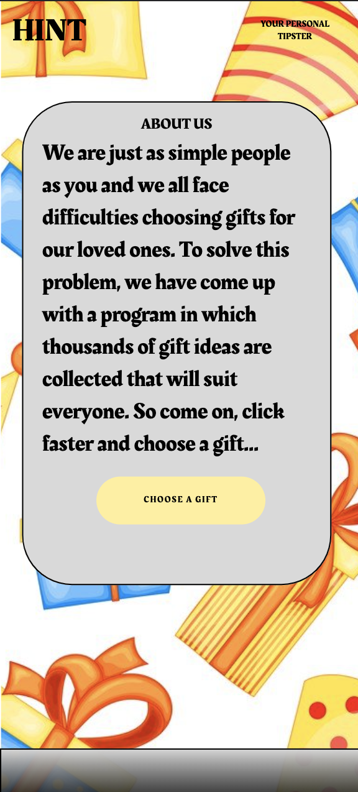
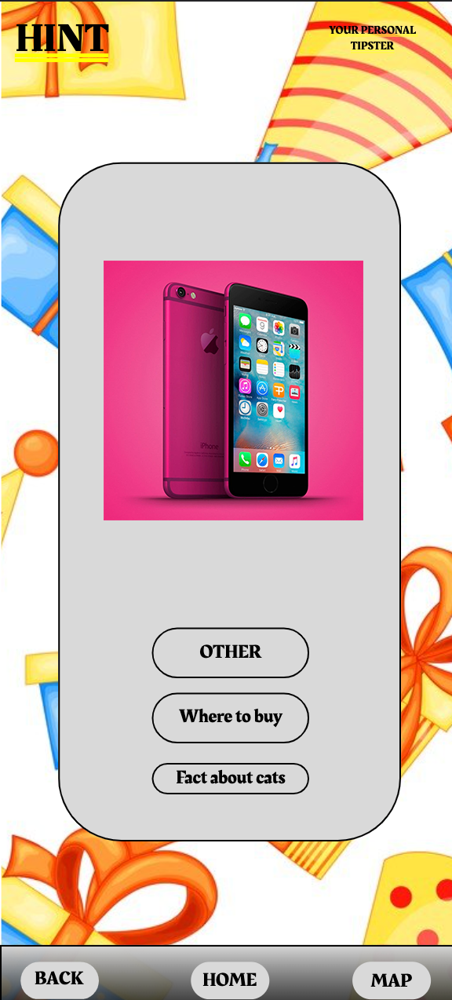
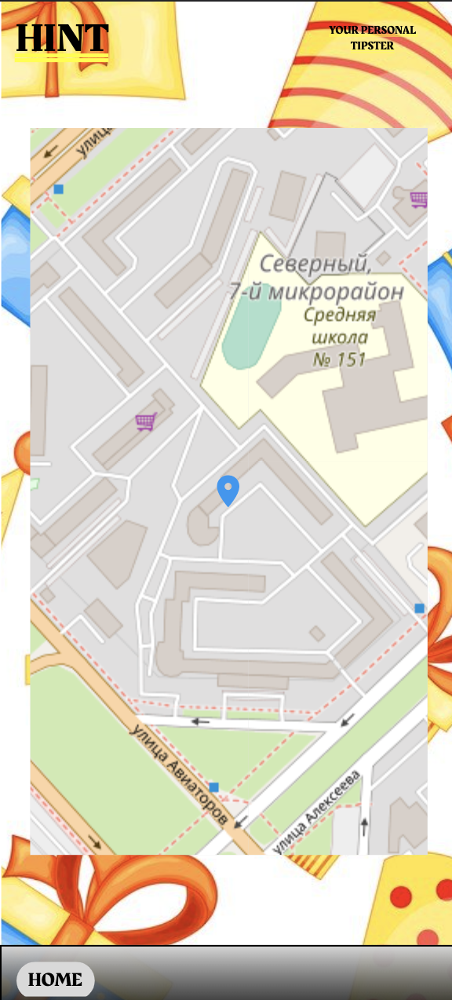
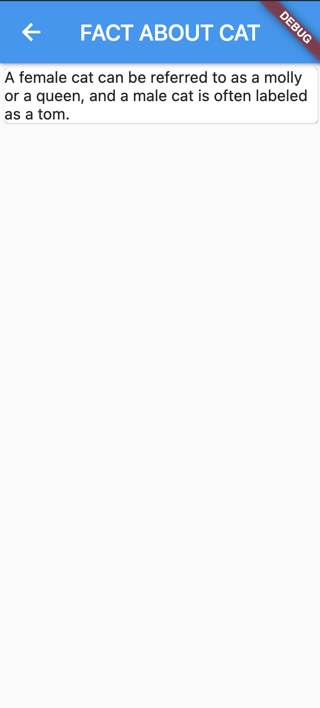

# Weather app

## Руководство пользователя

### Описание
Данное приложение напрвлено на предложение пользователю, что можно подарить кому-либо.

### Страницы приложения
При запуске пользователя встречает карточка приложения, которая рассказывает о главной идеи приложениея и предлагает сгенерировать подарок.

После нажатия "choose a gift" пользователя перенаправляет на страницу с предложенным подрком.

Кнопка "Where to buy" открывает карту, на которой указанна точка магазина, где можно его приобрести. Вернутся пользователь может нажав на кнопку "home" слева снизу
Так же пользователь может нажать "other" и он будет направлен на главную страницу приложения.

При нажатии на "fact about cat" пользователя перебрасывает на страницу с интересными рандомными фактами о котах. Вернутся пользователь может нажав стрелочку слева сверху.

 
